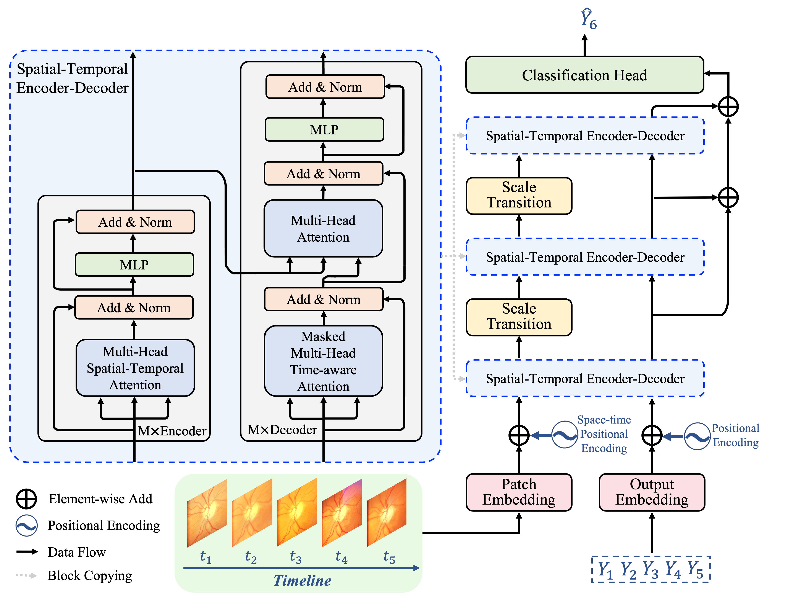

<!-- <h1> RaTEScore</h1> -->
<h1> Multi-Scale Spatio-Temporal Transformer-Based Imbalanced Longitudinal Learning for Glaucoma Forecasting From Irregular Time Series Images</h1>

Published in IEEE Journal of Biomedical and Health Informatics.
<div style='display:flex; gap: 0.25rem; '>
<a href='https://ieeexplore.ieee.org/document/10816575'></a>

</div>

## Introduction
In this study, we introduce the Multi-scale Spatio-temporal Transformer Network (MST-former) based on the transformer architecture tailored for sequential image inputs, which can effectively learn representative semantic information from sequential images on both temporal and spatial dimensions. The contributions are as follows:

1. We propose the multi-scale spatio-temporal transformer network (MST-former) to model the spatial and temporal information simultaneously using multi-scale encoderdecoder blocks, aiming at forecasting glaucoma from irregular time series fundus images.

2. We design time-aware temporal attention and multi-scale structure to reinforce the representation learning along the time and space dimensions, respectively, which can effectively address the irregular sampling issue.

3. We improve the Balanced Softmax Cross-entropy loss with temperature control to handle the class imbalanced issue in the training set. Compared with previous works that employ multi-stage training with the AC strategy, the τ-control Balanced Softmax Cross-entropy loss enables end-to-end training with the whole training samples, which is more efficient and elegant.




## Model Usage

Download the SIGF dataset at [here](https://github.com/XiaofeiWang2018/DeepGF). The downloaded file should be placed at .\Dataset\Original_Fold

First install the conda environment:
```shell
pip install -r requirements.txt
```

Then run the model with the following command:
```shell
python train_MSTformer_TrainValTest.py
```

## Citation
```bibtex
@article{yang2024multi,
  title={Multi-scale Spatio-temporal Transformer-based Imbalanced Longitudinal Learning for Glaucoma Forecasting from Irregular Time Series Images},
  author={Yang, Xikai and Wu, Jian and Wang, Xi and Yuan, Yuchen and Li, Jinpeng and Chen, Guangyong and Wang, Ning Li and Heng, Pheng-Ann},
  journal={IEEE Journal of Biomedical and Health Informatics},
  year={2024},
  publisher={IEEE}
}
```
